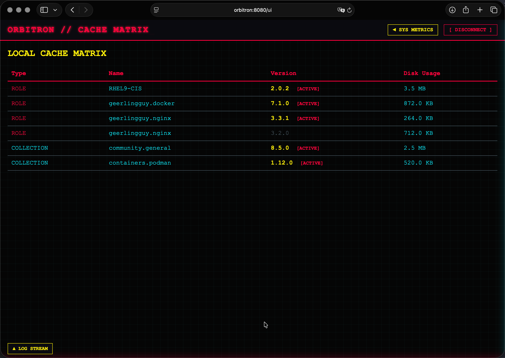

<div align="center">
  
</div>

# 🌌 Orbitron

A custom, lightweight Ansible Galaxy and Git-based role/collection mirror daemon written in Go.

Orbitron acts as a local mirror for Ansible Galaxy content and Git repositories, allowing isolated networks or
enterprise environments to cache, store, and serve Ansible roles and collections directly to `ansible-galaxy` clients.

---

## Key Features

* **Galaxy V1 & V3 API Support**: Complete compatibility with `ansible-galaxy role install` and
  `ansible-galaxy collection install`.
* **Cyberpunk Web Dashboard (`/ui`)**: Full-screen, zero-dependency terminal UI featuring cookie-backed session auth,
  live log streaming, and system telemetry.
* **On-the-Fly Archiving**: Packages unpacked Git-based roles into `.tar.gz` streams on-the-fly during download.
* **Parallel Background Sync**: Concurrent fetching of roles, collections, and shallow Git clones (`--depth 1`).
* **Flexible Authentication**: Unauthenticated pulls by default with an optional `require_auth_pull: true` toggle
  supporting Bearer tokens and HTTP Basic Auth.
* **Automated Lifecycle Management**: Integrated CLI commands for user creation (`orbitron:orbitron`),
  systemd service registration, logrotate configuration, and full uninstallation cleanup.
* **Access-Based Storage Pruner**: Built-in CLI flags (`--prune --days N`) that remove role/collection versions
  which have not been served to a client within the retention window, using an atomic per-storage access index
  (`.access.json`). Never-requested versions are always kept. Use the HTTP endpoint
  (`POST /api/v1/prune` with `{"dry_run": true, "days": N}`) to preview candidates non-interactively.
* **Liveness Probe (`/healthz`)**: Unauthenticated health endpoint for orchestrators, load balancers, and uptime
  monitors; reports `200` when the storage path is writable and `503` otherwise.
* **Async Sync Status API**: `GET /api/v1/sync/status` exposes the currently running sync job (kind, progress,
  failures) plus a bounded history of recent syncs.
* **Token Lifecycle API**: Create, list, revoke, and rotate administrative tokens over HTTP, with native expiry
  support and `token_ttl_days` configuration.
* **Content Inventory APIs**: `GET /api/v1/manifests` lists the stored requirement manifests (with content
  hashes) and `GET /api/v1/storage` exposes the precise cached-version inventory of roles and collections.
* **Official Ansible Collection (`chrisvanmeer.orbitron`)**: install, configure, and operate the daemon purely
  with Ansible – six purpose-built HTTP modules plus declarative install/mirror roles.

---

## 🖥️ Cyberpunk Web Dashboard (`/ui`)

Orbitron includes a full-screen Cyberpunk-themed Web UI hosted at `/ui` for real-time monitoring and storage inspection.

<div align="center">
  
</div>

### Dashboard Features

* **Local Cache Matrix**: Fullscreen view of all cached roles and collections — sortable columns
  (click the TYPE / NAME / VERSION / LAST ACCESS / DISK USAGE headers), an always-on `SEARCH TYPE / NAME / VERSION`
  filter, precise physical block-level disk usage, and an access-based **LAST ACCESS** column showing exactly when
  each version was last served to a client. Hovering a relative timestamp (`4 mins ago`) opens a cyan/yellow
  popunder with the full ISO 8601 timestamp. Roles and collections with multiple cached versions are collapsed
  into a single row (version count, most recent access, and total disk usage) that unfolds on click to reveal every
  version with its own **LAST ACCESS** date. The matrix auto-refreshes every 10 seconds and keeps your sort order,
  search text, and expanded groups intact across refreshes.
* **Cookie-Based Authentication**: Secure login modal backed by an HTTP-only 8-hour cookie session using any
  valid administrative token, gated behind an Orbitron SVG logo.
* **Tail-F Live Log Drawer**: Bottom sliding drawer (`▲ LOG STREAM`) that streams the tail of
  `/var/log/orbitron/orbitron.log` like `tail -f` — it stays pinned to the newest lines on every refresh, only
  releasing the pin when you scroll up to read history. Polls every 5 seconds.
* **Collapsible System Metrics Drawer**: Right sliding sidebar (`◄ SYS METRICS`, auto-refreshing every 10 seconds)
  displaying uplink status, last cache activity (access-index based), cache disk usage, mount free space, normalized
  OS distribution/version, system architecture (e.g., `AMD64`, `ARM64`), and last boot time.
* **Air-Gapped / Island-Mode Ready**: Embedded HTMX served directly from memory, eliminating external CDN calls
  or outbound network dependencies.
* **Hidden Feature**: Something happens when you type the mirror's name into the dashboard. Try it.

---

## Installation & Service Management

### Building from Source

```bash
make build
```

### Pre-compiled binaries

With each version increment, set of pre-compiled binaries are generated and available for direct download:
<https://github.com/chrisvanmeer/orbitron/releases>

Self contained binaries are provided for Linux AMD64 and Linux ARM64 architectures.

### Installing Orbitron

Executing `--install` as root automatically creates the `orbitron` system user/group, directories,
configuration files, systemd unit, and logrotate script, then enables and starts the daemon:

```bash
sudo ./bin/orbitron --install
```

### Daemon Service Control

```bash
sudo systemctl status orbitron
sudo systemctl restart orbitron
sudo systemctl stop orbitron
```

### Full Uninstallation

Executing `--uninstall` stops and disables the systemd unit, cleans up storage paths and manifests,
and removes system users and binaries:

```bash
sudo ./bin/orbitron --uninstall
```

---

## CLI Usage & Token Management

```bash
# Generate an administrative Bearer token
sudo orbitron --generate-token

# Generate raw token output (quiet mode for script exports)
export ORBITRON_TOKEN=$(sudo orbitron --generate-token -q)

# Revoke a token
sudo orbitron --revoke-token <TOKEN>

# Interactively scan and prune unreferenced role/collection versions
sudo orbitron --prune

# Start daemon with custom config
orbitron --config /etc/orbitron/config.yml

# Show the compiled-in version
orbitron --version
```

| Flag               | Shorthand | Description                                                             |
| :----------------- | :-------- | :---------------------------------------------------------------------- |
| `--generate-token` |           | Generates a new administrative Bearer token.                            |
| `--quiet`          | `-q`      | Suppresses verbose log formatting and prints the raw token string only. |
| `--revoke-token`   |           | Revokes an existing Bearer token by string value.                       |
| `--prune`          |           | Deletes roles/collections not served within the retention window.       |
| `--days`           |           | Retention window in days for `--prune` (default `90`).                  |
| `--version`        |           | Prints the version (e.g. `v0.5.0` or `dev`).                            |

---

## Configuration (`/etc/orbitron/config.yml`)

```yaml
listen_addr: "127.0.0.1:8080"
storage_path: "/var/lib/orbitron/storage"
log_path: "/var/log/orbitron/orbitron.log"
tokens_file: "/etc/orbitron/tokens.json"

# Set to true to require Bearer Token / Basic Auth for client pulls
require_auth_pull: false

# Maximum number of concurrent download/clone workers spawned during syncs
max_concurrency: 4

# Default lifetime of newly generated administrative tokens in days.
# 0 disables expiry so tokens never expire. Per-token TTLs can be
# overridden with the HTTP token API.
token_ttl_days: 0

# Optional forward proxy for outbound Galaxy API calls, collection downloads
# and git clones (e.g. a Squid proxy). Leave empty to fall back to the
# process HTTP_PROXY / HTTPS_PROXY / NO_PROXY environment variables.
http_proxy: ""
https_proxy: ""
no_proxy: ""
```

### Forward Proxy (Squid & co.)

When the mirror host has no direct internet route — or you want Galaxy traffic
to leave through a single choke point — point `http_proxy` / `https_proxy` at
your forward proxy. Git-backed roles and `git clone`/`fetch` operations use the
same settings, so every outbound hop honors the proxy.

```yaml
http_proxy: "http://squid.example.com:3128"
https_proxy: "http://squid.example.com:3128"
no_proxy: "localhost,127.0.0.1,.example.com"
```

* `http_proxy` proxies plain `http://` Galaxy/download requests.
* `https_proxy` proxies `https://` requests; if unset, `http_proxy` is used as
  a fallback (and vice versa).
* `no_proxy` is a comma-separated list of exclusions: exact hostnames,
  `.domain` / `*.domain` suffixes, a bare `*` to bypass everything, or CIDR
  ranges (e.g. `10.0.0.0/8`).

All three are optional. When left empty, Orbitron falls back to the standard
`HTTP_PROXY` / `HTTPS_PROXY` / `NO_PROXY` environment variables of the daemon
process.

---

## Mirroring Content (Server Ingestion)

Content is mirrored by posting YAML requirement manifests to Orbitron via cURL.
Orbitron stores the manifests and immediately triggers a background parallel download worker.
Each manifest is persisted under a content hash, so distinct manifests coexist on disk while
identical re-submissions are deduplicated. All stored manifests are replayed on full re-sync
(`/api/v1/sync`).

### 1. Mirroring Roles

**Role Manifest (`roles_requirements.yml`):**

```yaml
roles:
  - name: geerlingguy.nginx
    version: 3.3.1
  - name: geerlingguy.docker
    version: 7.1.0
  - name: RHEL9-CIS
    src: https://github.com/ansible-lockdown/RHEL9-CIS.git
    version: 2.0.2
```

**Ingest Command:**

```bash
curl -X POST http://127.0.0.1:8080/api/v1/requirements/roles \
  -H "Authorization: Bearer $ORBITRON_TOKEN" \
  -H "Content-Type: text/yaml" \
  --data-binary @roles_requirements.yml
```

### 2. Mirroring Collections

**Collection Manifest (`collections_requirements.yml`):**

```yaml
collections:
  - name: community.general
    version: 8.5.0
  - name: containers.podman
    version: 1.12.0
```

**Ingest Command:**

```bash
curl -X POST http://127.0.0.1:8080/api/v1/requirements/collections \
  -H "Authorization: Bearer $ORBITRON_TOKEN" \
  -H "Content-Type: text/yaml" \
  --data-binary @collections_requirements.yml
```

### 3. Version Specifiers

The `version` field accepts the same range specifiers Ansible does. Orbitron
resolves them against the published Galaxy indexes at sync time and stores the
highest matching release, or every published version when `all` is used (roles
are mirrored as git tags, collections as tarballs).

| Specifier            | Meaning                                     | Example         |
| -------------------- | ------------------------------------------- | --------------- |
| *(empty)* / `latest` | Highest published version                   | `latest`        |
| `all`                | Every published version                     | `all`           |
| `==1.4.5` / `1.4.5`  | Exact version (or tag/branch for git `src`) | `1.4.5`         |
| `>=1.0.0`            | At least 1.0.0                              | `>=1.0.0`       |
| `>1.0.0,<2.0.0`      | Ranges AND-combined                         | `>1.0.0,<2.0.0` |
| `~=1.4.5`            | Compatible release (>=1.4.5, prefix 1.4)    | `~=1.4.5`       |
| `!=2.0.0`            | Anything but 2.0.0                          | `!=2.0.0`       |
| `==1.4.*` / `1.*`    | Wildcard prefix match                       | `==1.4.*`       |

```yaml
roles:
  - name: geerlingguy.nginx
    version: ">=2.0.0"
collections:
  - name: community.general
    version: "~=8.0"
  - name: ansible.posix
    version: all
```

`all` is a reserved keyword and works for Galaxy roles and collections (not
for git `src` items): every published version is fetched and kept, including
new releases, on each sync. Like `latest` and specifier versions, `all` is
never "fully satisfied" — a sync always re-checks the published indexes.

Orbitron never re-downloads content it already has on disk: a version that is
present is trusted until it is deleted. To repair a corrupt or stale version,
remove that version first (purge or `DELETE /api/v1/storage/...`) and let the
next sync fetch it again.

### 4. Force Full Re-Sync

To re-sync all persisted manifests stored on the Orbitron server:

```bash
curl -X POST http://127.0.0.1:8080/api/v1/sync \
  -H "Authorization: Bearer $ORBITRON_TOKEN"
```

### 5. Deleting Cached Versions

Orbitron exposes authorized `DELETE` endpoints to remove a **single** cached version of a role or
collection (one artifact/directory plus its pin in the stored manifest). Endpoints require a valid
admin Bearer token; without one the request is rejected with `401`.

**Delete a single cached role version:**

```bash
curl -X DELETE http://127.0.0.1:8080/api/v1/storage/roles/geerlingguy.nginx/1.2.3 \
  -H "Authorization: Bearer $ORBITRON_TOKEN"
```

**Delete a single cached collection version:**

```bash
curl -X DELETE http://127.0.0.1:8080/api/v1/storage/collections/community.general/8.5.0 \
  -H "Authorization: Bearer $ORBITRON_TOKEN"
```

**Ansible Task Snippet:**

```yaml
- name: Delete a cached role version from Orbitron
  ansible.builtin.uri:
    url: "http://127.0.0.1:8080/api/v1/storage/roles/geerlingguy.nginx/1.2.3"
    method: DELETE
    headers:
      Authorization: "Bearer {{ orbitron_token }}"
    status_code: 200

- name: Delete a cached collection version from Orbitron
  ansible.builtin.uri:
    url: "http://127.0.0.1:8080/api/v1/storage/collections/community.general/8.5.0"
    method: DELETE
    headers:
      Authorization: "Bearer {{ orbitron_token }}"
    status_code: 200
```

### Automated Ingestion via Ansible Playbook

You can also automate feeding Orbitron or triggering a re-sync directly within your Ansible playbooks using
the `ansible.builtin.uri` module.

**Playbook Example (`feed_orbitron.yml`):**

```yaml
---
- name: Feed and Sync Orbitron Mirror Daemon
  hosts: localhost
  connection: local
  vars:
    orbitron_url: "http://127.0.0.1:8080"
    orbitron_token: "{{ lookup('env', 'ORBITRON_TOKEN') }}"

  module_defaults:
    ansible.builtin.uri:
      method: POST
      headers:
        Authorization: "Bearer {{ orbitron_token }}"
        Content-Type: "text/yaml"
      status_code: 202

  tasks:
    - name: Push Role Requirements to Orbitron
      ansible.builtin.uri:
        url: "{{ orbitron_url }}/api/v1/requirements/roles"
        body: "{{ lookup('file', 'roles_requirements.yml') }}"

    - name: Push Collection Requirements to Orbitron
      ansible.builtin.uri:
        url: "{{ orbitron_url }}/api/v1/requirements/collections"
        body: "{{ lookup('file', 'collections_requirements.yml') }}"

    - name: Trigger Full Re-Sync on Orbitron
      ansible.builtin.uri:
        url: "{{ orbitron_url }}/api/v1/sync"
        headers:
          Authorization: "Bearer {{ orbitron_token }}"
      tags:
        - never
        - sync
```

**Run the Automation Playbook:**

```bash
export ORBITRON_TOKEN=$(sudo orbitron --generate-token -q)
ansible-playbook feed_orbitron.yml
```

---

## Ansible Collection (`chrisvanmeer.orbitron`)

The repository ships an official Ansible collection under
`ansible_collections/chrisvanmeer/orbitron` to install, configure, and operate
Orbitron without hand-written `curl`/`systemctl` steps. It covers the full
lifecycle: daemon installation and service management, token bootstrapping,
declarative mirroring, and day-two operations such as purging cached versions.

### What it provides

* **Six HTTP modules** – `orbitron_info` (facts: health, storage inventory,
  manifests, sync status, tokens), `orbitron_token` (create/rotate/revoke),
  `orbitron_manifest` (store role/collection requirements), `orbitron_sync`
  (trigger a full sync, optionally wait), `orbitron_purge` (remove one cached
  version), `orbitron_prune` (invoke the gated prune API). All modules accept
  `url`, `token` (or `ORBITRON_TOKEN`), `validate_certs`, and `timeout`.
* **`chrisvanmeer.orbitron.orbitron` role** – end-to-end daemon install:
  resolves and downloads the release binary, runs `orbitron --install` to
  bootstrap the system user/dirs/systemd/logrotate, renders
  `/etc/orbitron/config.yml`, ensures the service is healthy, and generates (or
  reuses) an initial admin token. Optionally prunes stale cached versions via
  `orbitron_prune_days` (retention window; dry-run preview by default through
  `orbitron_prune_dry_run`). The binary is staged in `orbitron_stage_dir`
  (default `/var/tmp/orbitron-ansible`) and that directory is removed again
  afterwards; because the staged binary is executed, the path must not be on a
  `noexec` mount (override it, e.g. with `/opt/orbitron/stage`, when `/var` is
  mounted `noexec`). Supports full uninstallation with `orbitron_state: absent`.
* **`chrisvanmeer.orbitron.orbitron_mirror` role** – declarative mirroring from
  structured role/collection lists or local requirements files, with an
  optional `orbitron_mirror_wait_sync` on completion.

### Installing the collection

```bash
# Install from Ansible Galaxy
ansible-galaxy collection install chrisvanmeer.orbitron

# Or build and install directly from this repository
ansible-galaxy collection build ansible_collections/chrisvanmeer/orbitron
ansible-galaxy collection install chrisvanmeer-orbitron-<version>.tar.gz
```

The full variable reference, module docs, and security notes live in the
collection's own `README.md`; example playbooks ship under
`ansible_collections/chrisvanmeer/orbitron/examples/`.

### Example playbook (`orbitron_daemon.yml`)

Install the daemon on a fresh host and mirror a set of roles/collections in one
run. The `orbitron` role generates the admin token on first install and exposes
it as `orbitron_admin_token`; the `orbitron_mirror` role consumes it through
`orbitron_mirror_token` (a vault value if you pre-set `orbitron_token`):

```yaml
---
- name: Install Orbitron and mirror content
  hosts: mirrors
  become: true
  vars:
    # Optional pre-set admin token (or the role generates one and stores it in
    # orbitron_token_path, default /root/.orbitron_token, mode 0600).
    orbitron_token: "{{ vault_orbitron_token }}"

  roles:
    - role: chrisvanmeer.orbitron.orbitron
      vars:
        # Leave orbitron_version unset to install the latest release.
        orbitron_version: v1.3.2
        orbitron_listen_addr: 127.0.0.1:8080
        orbitron_token_ttl_days: 365
        # Optional: route outbound Galaxy / git traffic via a forward proxy
        # (e.g. Squid). Leave unset to fall back to environment proxies.
        orbitron_http_proxy: http://squid.example.com:3128
        orbitron_https_proxy: http://squid.example.com:3128
        orbitron_no_proxy: "localhost,127.0.0.1,.example.com"
        # Optional: prune versions not served for 60+ days. Dry-run preview by
        # default; set orbitron_prune_dry_run: false to delete for real.
        orbitron_prune_days: 60
    - role: chrisvanmeer.orbitron.orbitron_mirror
      vars:
        orbitron_mirror_token: "{{ orbitron_admin_token | default(vault_orbitron_token) }}"
        orbitron_mirror_collections:
          - name: community.general
            version: "8.5.0"
          - name: containers.podman
            version: "1.12.0"
        orbitron_mirror_roles:
          - name: geerlingguy.nginx
            version: "3.3.1"
```

```bash
ansible-playbook -i hosts orbitron_daemon.yml
```

### Operating an existing daemon with the modules

Against a daemon that is already running, point tasks straight at the API using
the HTTP modules:

```yaml
- name: Facts about the running daemon
  chrisvanmeer.orbitron.orbitron_info:
    url: http://127.0.0.1:8080
    token: "{{ orbitron_token }}"

- name: Store a collection requirements manifest
  chrisvanmeer.orbitron.orbitron_manifest:
    type: collections
    content: |
      collections:
        - name: community.docker
          version: "3.6.0"
    token: "{{ orbitron_token }}"

- name: Trigger a full sync and wait for completion
  chrisvanmeer.orbitron.orbitron_sync:
    url: http://127.0.0.1:8080
    token: "{{ orbitron_token }}"
    wait: true
```

---

## Ansible Client Configuration

To configure `ansible-galaxy` to use Orbitron as its Galaxy server for both roles and collections,
place an `ansible.cfg` in your project root:

### `ansible.cfg`

```ini
[defaults]
roles_path = ./roles
collections_path = ./collections

[galaxy]
server_list = orbitron

[galaxy_server.orbitron]
url = http://127.0.0.1:8080/api/
# token = YOUR_ORBITRON_TOKEN  # Uncomment if require_auth_pull is set to true
```

### Fetching Roles & Collections with `ansible-galaxy`

**Install Roles:**

```bash
ansible-galaxy role install -r roles_requirements.yml
```

**Install Collections:**

```bash
ansible-galaxy collection install -r collections_requirements.yml
```

---

## Management & Operations API

Orbitron exposes several administrative endpoints for health checks, sync visibility, and token lifecycle
management. All management endpoints except `/healthz` require a valid Bearer/Basic authorization header.

### 1. Health Check (`/healthz`)

Unauthenticated liveness probe for orchestrators, load balancers, and uptime monitors. Returns `200`
`{"status":"ok"}` while the storage path is writable, and `503 {"status":"degraded"}` otherwise.

```bash
curl http://127.0.0.1:8080/healthz
```

### 2. Sync Status (`GET /api/v1/sync/status`)

Returns the currently running background sync (kind, progress, per-item failures) together with a bounded
history of recently finished syncs, so automation can wait on completion instead of polling metrics.

```bash
curl -H "Authorization: Bearer $ORBITRON_TOKEN" http://127.0.0.1:8080/api/v1/sync/status
```

```json
{
  "current": {"kind": "full", "status": "running", "total": 4, "done": 2, "failures": []},
  "history": []
}
```

### 3. Token Lifecycle (`/api/v1/tokens`)

| Method   | Path                          | Description                                               |
| :------- | :---------------------------- | :-------------------------------------------------------- |
| `POST`   | /api/v1/tokens                | Generate a token (optional `ttl_days` / `label` in body). |
| `GET`    | /api/v1/tokens                | List token metadata (`?full=true` reveals the secrets).   |
| `DELETE` | /api/v1/tokens/{token}        | Revoke a token.                                           |
| `POST`   | /api/v1/tokens/{token}/rotate | Replace a token, revoking the original atomically.        |

**Create a token with a 30-day lifetime:**

```bash
curl -X POST http://127.0.0.1:8080/api/v1/tokens \
  -H "Authorization: Bearer $ORBITRON_TOKEN" \
  -H "Content-Type: application/json" \
  -d '{"ttl_days": 30, "label": "ci"}'
```

Tokens honour the global `token_ttl_days` configuration by default; an explicit `ttl_days: 0` in the request
body disables expiry for that token. Expired tokens are rejected by every authenticated endpoint and pruned
from the token store at daemon startup.

### 4. Stored Requirements Manifests (`GET /api/v1/manifests`)

Lists every requirements manifest currently stored on the mirror, grouped by type, with the content hash
(`sha256`) used for idempotent ingestion:

```bash
curl -H "Authorization: Bearer $ORBITRON_TOKEN" http://127.0.0.1:8080/api/v1/manifests
```

```json
{
  "roles": [{"file": "roles_x_requirements.yml", "sha256": "737690a6..."}],
  "collections": []
}
```

### 5. Storage Inventory (`GET /api/v1/storage`)

Returns the cached-version inventory of every role (directory) and collection (archive) on disk, including
which versions are actively declared by a stored manifest and their physical size in bytes:

```bash
curl -H "Authorization: Bearer $ORBITRON_TOKEN" http://127.0.0.1:8080/api/v1/storage
```

```json
{
  "roles": [
    {"type": "role", "name": "geerlingguy.nginx", "versions": [{"version": "1.2.3", "declared": true, "size_bytes": 20480}]}
  ],
  "collections": []
}
```

### 6. Prune API (`POST /api/v1/prune`)

Drops role/collection versions that have not been served to a client for at least `days` days, based on the
access index (`.access.json`). Versions that were never accessed are always kept.

A JSON body of `{"dry_run": true, "days": N}` reports what would be pruned without deleting; `{"dry_run": false}`
(or omitted) deletes for real. If `days` is omitted the default retention window of 90 days is used.

```bash
# Preview the candidates (nothing is deleted)
curl -X POST http://127.0.0.1:8080/api/v1/prune \
  -H "Authorization: Bearer $ORBITRON_TOKEN" \
  -H "Content-Type: application/json" \
  -d '{"dry_run": true, "days": 90}'
```

```json
{
  "items": ["/var/lib/orbitron/storage/roles/geerlingguy.nginx/2.0.1"],
  "freed_bytes": 40960,
  "executed": false
}
```

---

## Reverse Proxy & Security (Recommended)

While Orbitron supports Bearer tokens and HTTP Basic Auth, it natively serves traffic over standard HTTP.
If you are mirroring private Git repositories using Personal Access Tokens (PATs) embedded in the `src` URL
(e.g., `https://oauth2:<TOKEN>@github.com/...`), these tokens could be exposed in transit.

It is highly recommended to run Orbitron behind a reverse proxy like **Nginx** configured with TLS/SSL.
This ensures all API calls, token transmissions, Web UI logins, and Git credentials remain securely encrypted.

### Nginx Example Configuration

Below is a standard Nginx reverse proxy configuration that secures
Orbitron with HTTPS and redirects all HTTP traffic:

```nginx
# Redirect HTTP to HTTPS
server {
    listen 80;
    server_name orbitron.example.com;
    return 301 https://$host$request_uri;
}

# HTTPS Server
server {
    listen 443 ssl;
    server_name orbitron.example.com;

    # SSL Certificates (e.g., Let's Encrypt)
    ssl_certificate /etc/letsencrypt/live/https://orbitron.example.com/fullchain.pem;
    ssl_certificate_key /etc/letsencrypt/live/https://orbitron.example.com/privkey.pem;

    ssl_protocols TLSv1.2 TLSv1.3;
    ssl_ciphers HIGH:!aNULL:!MD5;

    location / {
        proxy_pass http://127.0.0.1:8080;

        # Forward essential headers to Orbitron
        proxy_set_header Host $host;
        proxy_set_header X-Real-IP $remote_addr;
        proxy_set_header X-Forwarded-For $proxy_add_x_forwarded_for;
        proxy_set_header X-Forwarded-Proto $scheme;

        # Disable buffering for smooth on-the-fly .tar.gz streaming
        proxy_buffering off;

        # Allow large payloads if pushing massive requirement manifests
        client_max_body_size 10M;
    }
}
```

*Note: If you use a reverse proxy, ensure your `ansible.cfg` points to the `https://` address.*

---

## Docker & Docker Compose

Orbitron ships an official container image published to GHCR on every release
tag: `ghcr.io/chrisvanmeer/orbitron:<version>` (also tagged `<major>.<minor>`
and `latest`). The image is multi-architecture (`linux/amd64`, `linux/arm64`),
runs the daemon as a non-root user, and bundles `git`/`openssh-client` so
git-backed roles and collections keep mirroring inside a container.

The image renders `config.yml` from environment variables at startup, so no
config file needs to be mounted. A fresh admin token is generated and printed
to the container logs on first start.

### Getting the admin token

```bash
docker compose logs orbitron | grep "ADMIN TOKEN"
```

Or without Compose: `docker logs <container> | grep "ADMIN TOKEN"`. The token
is persisted in `<storage>/tokens.json`, so it only appears once.

### Docker Compose example

```bash
docker compose up -d --build   # build locally
docker compose up -d           # or pull the pre-built image
docker compose logs -f
```

Then point Ansible at `http://localhost:8080`:

```ini
# ansible.cfg
[galaxy_client]
galaxy_server = http://localhost:8080
# token = YOUR_ORBITRON_TOKEN   # uncomment if require_auth_pull is true
```

### Container environment variables

| Variable                     | Default                  | Description                                                      |
| ---------------------------- | ------------------------ | ---------------------------------------------------------------- |
| `ORBITRON_LISTEN_ADDR`       | `0.0.0.0:8080`           | Address the daemon binds inside the container.                   |
| `ORBITRON_STORAGE_PATH`      | `/data`                  | Storage root for roles, collections and manifests.               |
| `ORBITRON_LOG_PATH`          | *stdout*                 | Log file inside the container; empty logs to stdout.             |
| `ORBITRON_TOKENS_FILE`       | `${STORAGE}/tokens.json` | Token registry file.                                             |
| `ORBITRON_REQUIRE_AUTH_PULL` | `false`                  | Require a token to pull/download cached content.                 |
| `ORBITRON_MAX_CONCURRENCY`   | `4`                      | Concurrent download/clone workers during syncs.                  |
| `ORBITRON_TOKEN_TTL_DAYS`    | `0`                      | Lifetime of generated admin tokens in days (`0` = never expire). |
| `ORBITRON_HTTP_PROXY`        | *empty*                  | Forward proxy for `http://` outbound requests.                   |
| `ORBITRON_HTTPS_PROXY`       | *empty*                  | Forward proxy for `https://` outbound requests.                  |
| `ORBITRON_NO_PROXY`          | *empty*                  | Comma-separated proxy exclusions.                                |
| `ORBITRON_AUTO_TOKEN`        | `true`                   | Generate an admin token on first start if none exists.           |

### Persistence

Mount a volume at `/data` (the Compose file uses the named volume
`orbitron-data`). It holds the mirrored roles/collections, the access-recording
data (`.access.json`), and the admin token, so a container rebuild never
wipes the cache.

---

## HashiCorp Nomad

Deploy the daemon on Nomad with the included job specification:

```bash
nomad job validate orbitron.nomad.hcl
nomad job plan   orbitron.nomad.hcl
nomad job run    orbitron.nomad.hcl
```

The jobspec (`orbitron.nomad.hcl`) registers an HTTP service with an
`/healthz` check, uses the GHCR image with `force_pull`, and persists the
mirror cache through a dedicated **host volume** (`orbitron-data`) so the cache
survives redeploys and node restarts. Register that volume on the target client
before running the job:

```hcl
client {
  host_volume "orbitron-data" {
    path      = "/srv/orbitron-data"
    read_only = false
  }
}
```

The container auto-generates the admin token on first start; retrieve it from
the alloc logs:

```bash
nomad alloc logs <alloc-id> | grep "ADMIN TOKEN"
```

Optional Traefik routing tags and Vault Workload Identity templates are
included as commented sections in the jobspec. The bundle also runs fine with
the `-bind-allocation` Docker networking modes; port `http` maps onto the
container's `:8080`.

---

## Prometheus Telemetry & Metrics

Orbitron exposes daemon and storage metrics at `/metrics` using standard Prometheus exposition format
(`text/plain; version=0.0.4`). Access to this endpoint requires Bearer Token or HTTP Basic Auth.

### Exposed Metrics

| Metric                                              | Type    | Description                                                                  |
| :-------------------------------------------------- | :------ | :--------------------------------------------------------------------------- |
| `orbitron_uptime_seconds`                           | Counter | Total daemon uptime in seconds.                                              |
| `orbitron_roles_total`                              | Gauge   | Number of distinct cached role names (as listed in the dashboard).           |
| `orbitron_collections_total`                        | Gauge   | Number of distinct cached collection names (as listed in the dashboard).     |
| `orbitron_role_versions_total`                      | Gauge   | Number of cached role versions across all roles.                             |
| `orbitron_collection_versions_total`                | Gauge   | Number of cached collection versions across all collections.                 |
| `orbitron_cached_versions_total`                    | Gauge   | Number of cached versions of roles and collections combined.                 |
| `orbitron_namespaces_total`                         | Gauge   | Number of distinct collection namespaces in the cache.                       |
| `orbitron_storage_bytes`                            | Gauge   | Block-allocated disk usage of all cached roles and collections in bytes.     |
| `orbitron_roles_bytes`                              | Gauge   | Block-allocated disk usage of cached role versions in bytes.                 |
| `orbitron_collections_bytes`                        | Gauge   | Block-allocated disk usage of cached collection archives in bytes.           |
| `orbitron_cached_item_bytes{type,name}`             | Gauge   | Disk usage of one cached role or collection across all of its versions.      |
| `orbitron_cached_version_bytes{type,name,version}`  | Gauge   | Disk usage of a single cached role or collection version.                    |
| `orbitron_active_tokens_total`                      | Gauge   | Number of registered Bearer tokens.                                          |

Byte values follow the dashboard's DISK USAGE column: block-allocated size
(`st_blocks * 512`), falling back to the logical file size on filesystems
without block accounting. Counts follow the cache matrix exactly — a role only
counts once it holds at least one cached version, and collection archives are
parsed from `<namespace>-<name>-<version>.tar.gz` filenames.

### Scraping Metrics

**cURL via Bearer Token:**

```bash
curl -H "Authorization: Bearer $ORBITRON_TOKEN" http://127.0.0.1:8080/metrics
```

**cURL via Basic Auth:**

```bash
curl -u "token:$ORBITRON_TOKEN" http://127.0.0.1:8080/metrics
```

**Prometheus Configuration Example (`prometheus.yml`):**

```yaml
scrape_configs:
  - job_name: 'orbitron'
    metrics_path: '/metrics'
    authorization:
      credentials: 'YOUR_ORBITRON_TOKEN'
    static_configs:
      - targets: ['127.0.0.1:8080']
```

### Grafana Dashboard

A ready-made dashboard for the metrics above lives in `grafana/dashboards/orbitron.json`.

* **Import:** Dashboards → Import → upload the JSON file. During import Grafana
  asks which Prometheus **data source** to bind the dashboard to — pick the one
  that scrapes your Orbitron instance(s). Every panel reads from that source.
* **Multi-daemon:** the `Orbitron instance` template variable (default `All`)
  is built from the `instance` label of the scraped targets, so a single
  dashboard follows every Orbitron daemon behind the same Prometheus.
* **Contents:** overview stats (uptime, disk usage, roles, collections, cached
  versions, namespaces, tokens), storage and version growth over time, plus
  top-item bar gauge and item/version size tables.
* Remember the `/metrics` endpoint requires token auth — see the scrape
  configuration above.

---

## Author

Chris van Meer - <chris@atcomputing.nl>

---

## License

This project is licensed under the GNU General Public License v3.0 (see the
top-level `LICENSE` file). The Ansible collection in `ansible_collections/` is
licensed under the same terms, as noted in `COPYING`.
